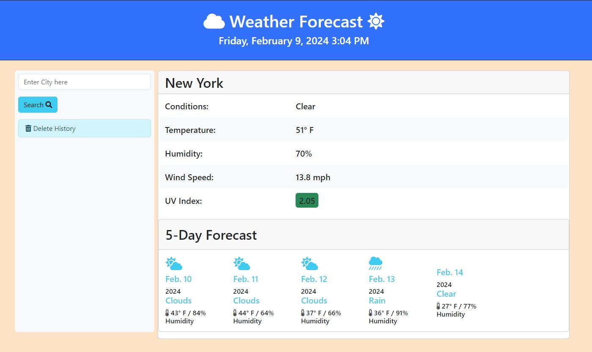
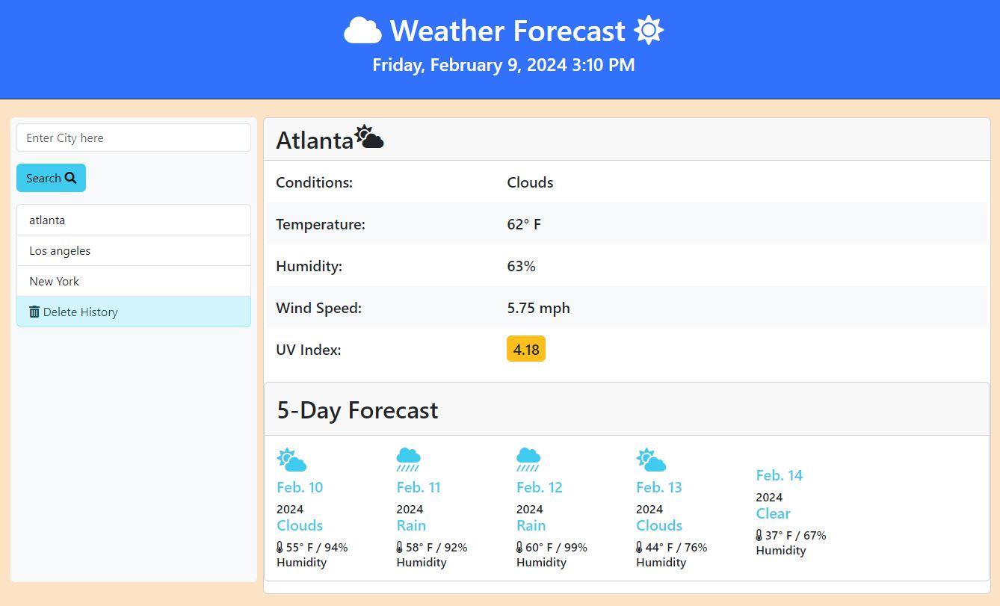

# FiveDayForecast

Webapp that will search for a city by name and display the current weather conditions from openweathermaps.org
It will also display the 5 day forecast of that city and retain history of searched cities

## Getting Started:
1. Clone the repository from https://github.com/mojo718/FiveDayForecast
2. Open script.js in your favorite code editor to review the Javascript

Live site:
https://mojo718.github.io/FiveDayForecast

Screenshots Below:

